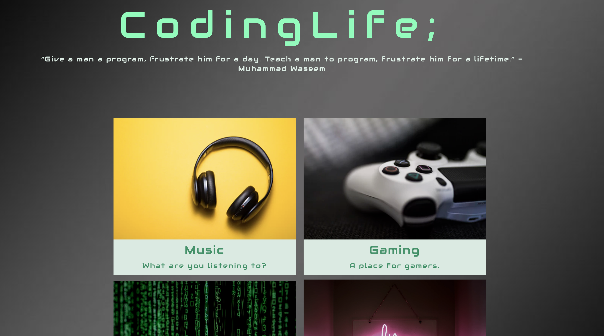

<h1> CodingLife; </h1>

## Projec #2 

<h2> Overview </h2>

A website that allows people to **post and reply** to each other about coding or other topics. In other words, a tech forum with a focus on developers.

Our goal with this website was to create an online forum that would cover **the CRUD**
 criteria effectively.

## Features 

- [x] The shell of a working forum
- [x] Most of the basic functionality of a forum is in place.
- [] 
- [] 

##Implemented Technology

- Sass
- Bootstrap
- Express
- MySQL
- JQuery
- Sequelize
- Handlebars

<h2> Pending </h2>

Put into the project we could of finished the sign-up feature and had a fully functioning forum page.
In the future we would expand on this to add user accounts to add a bio, post signature, and account photo.

https://codinglifeucd.herokuapp.com/

